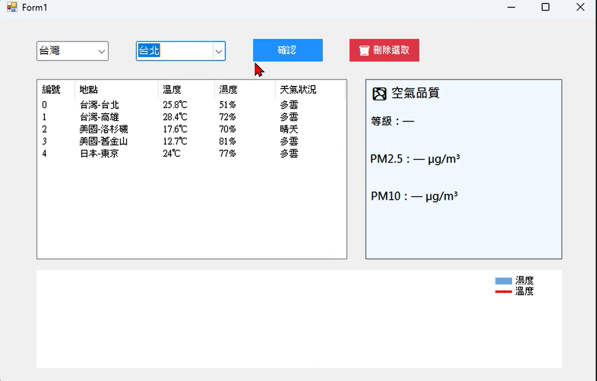
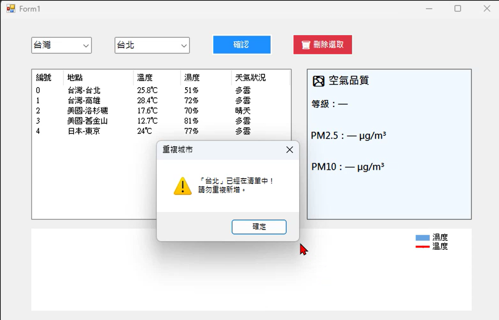
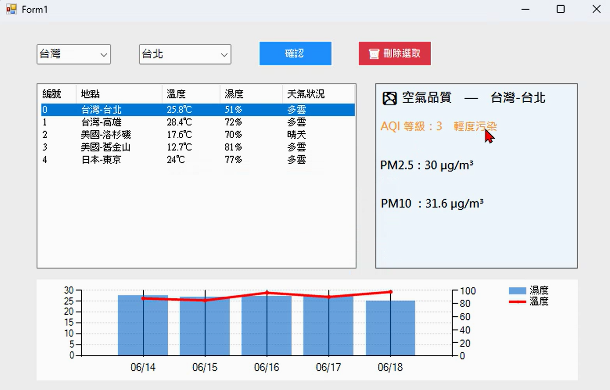
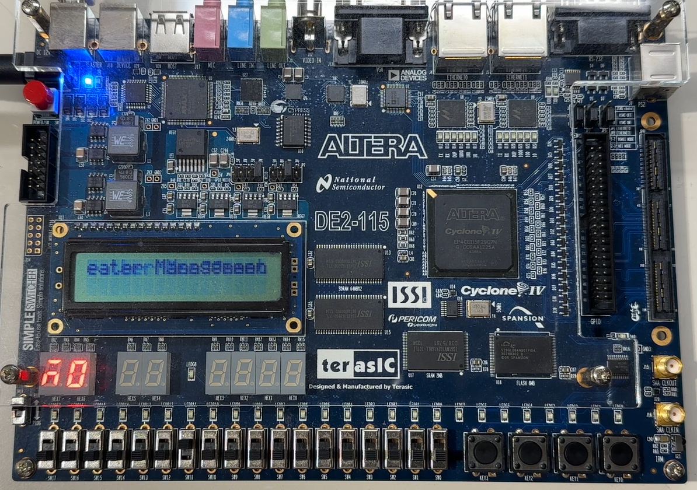
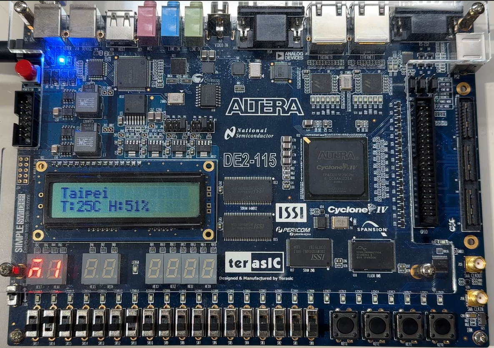
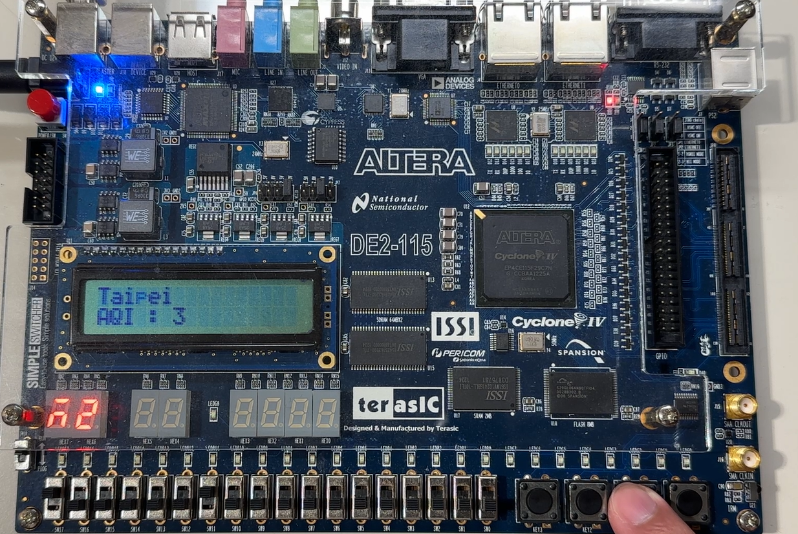
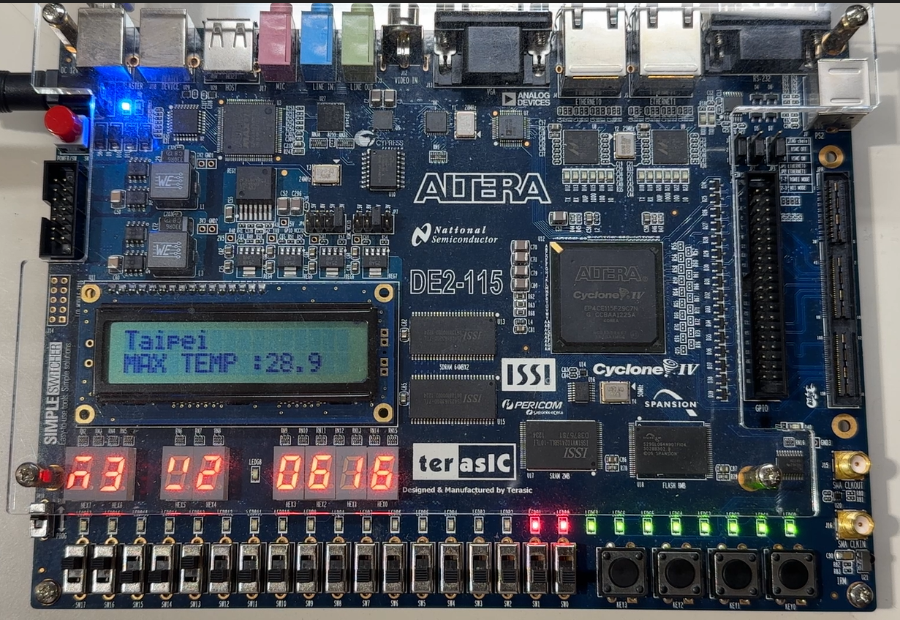

# FPGA期末專題-城市天氣監測系統
本專題製作了一個整合電腦端與 FPGA 硬體的即時天氣監測系統，系統透過 C# 程式獲取[OpenWeatherMap](https://openweathermap.org/)的即時氣象數據，並透過通訊介面傳輸至 FPGA 進行處理與顯示。

## 電腦端 (C#)
### 功能
* 從 OpenWeatherMap API 獲取指定城市的即時天氣數據
* 讀取氣溫、濕度、天氣狀況、AQI、PM2.5、PM10、五天天氣預測、降雨機率
* 提供圖形化使用者介面，顯示目前監測狀態
* 負責將解析後的數據透過序列埠傳輸至 FPGA
* 可即時更新數據
### 資料傳輸格式
為了確保 FPGA 能正確解析數據，定義了以下格式：
* 當天天氣： `C:{enCityName},{rawTempStr},{humiValue},{enCondition},`
* 當天空氣品質： `A:{data.Aqi},{pm25Formatted},{pm10Formatted},`
* 五天預報： `F:{f.Date},{f.TempMax},{f.TempMin},{f.Humi},{popFormatted}\n`
### 介面展示
* 選擇城市

* 重複選擇城市

* 點選城市顯示詳細資料

 

## FPGA端 (VHDL)
### 實驗板規格
* Cyolone IV E EP4CE115F29C7
### 功能
* 傳送要求觀看城市數值
* 接收 UART 傳入的數據並分析資料
* mode 0 : 顯示Weather Management System的跑馬燈

* mode 1 : 顯示當天的天氣資訊(溫度、濕度、天氣狀況)在LCD上

* mode 2 : 顯示當天空氣品質(AQI、PM2.5、PM10)在LCD上

* mode 3 : 顯示五天天氣預報，並將降雨機率用LED加強顯示

